\vspace{35mm}
Running title: The fecal microbiome as a tool for monitoring and
predicting response outcomes in Ustekinumab-treated, anti-TNF-alpha
refractory Crohn’s Disease patients.

\vspace{35mm}
Matthew K. Doherty**2, Tao
Ding**2***α*, Charlie Koumpouras**2,
Shannon Telesco**1, Calixte Monast**1, and Patrick
D. Schloss**2**†

† To whom correspondence should be addressed: <pschloss@umich.edu>

1. Janssen Pharmaceutical Companies of Johnson & Johnson, Spring House,
PA, USA

2. Department of Microbiology and Immunology, University of Michigan,
Ann Arbor, MI, USA

*α* Currently at *...*

\newpage
Abstract
--------

*Background:* Crohn’s disease (CD) is a global health issue
characterized by patches of ulceration and inflammation along the
gastrointestinal tract. Individuals with CD have reduced microbial
diversity in their guts, compared to healthy individuals. It remains
unclear if this reduced diversity is a result or cause of pathogenesis.
We investigated the relationship between the fecal microbiome and
clinical phenotypes in subjects with moderate to severe CD treated with
Ustekinumab (UST) in a Phase 2b study to determine whether the fecal
microbiome at baseline is predictive of disease severity and therapeutic
response, as well as if the fecal microbiota changes due to therapy.

*Methods:* The 16S rRNA gene from patient stool samples was sequenced
using the Illumina MiSeq platform. The resulting sequences were curated
and assigned to taxonomic groups using the mothur software package to
determine the bacterial communities and relative abundance of bacterial
species present in these patients. The relative abundance among the
fecal microbiota, patient demographic data, and clinical metadata were
used as input to a random forest machine-learning algorithm to predict
disease severity and response to treatment with UST.

*Results:* Fecal microbial diversity at baseline significantly
correlates with markers for disease severity, such as Crohn’s Disease
Activity Index (CDAI), stool frequency, and disease duration.
Additionally, the overall community structure of the microbiome was
significantly different based on stool frequency, CRP, fecal
lactoferrin, fecal calprotectin, corticosteroid use, disease duration,
and tissue involvement. Baseline fecal microbiome community structures
and species diversity were significantly different among responders and
non-responders to UST treatment. Faecalibacterium, among other taxa, was
significantly more abundant in responders/remitters. Additionally, the
microbiome of clinical responders changed over time, in contrast to
nonresponsive subjects. Using AUC-RF, differences in the baseline
microbiome and clinical metadata were able to predict response to UST,
especially remission, with some AUCs approaching 0.85.

*Conclusions:* The ability to predict and monitor response to treatment
using the microbiome will likely provide another clinical tool in
treating CD patients. Additionally, the observed baseline differences in
fecal microbiota and changes due to therapeutic response will allow
further investigation into the microbes important in CD pathogenesis as
well as establishing and maintaining CD remission. Finally, beneficial
microbes associated with response to treatment could be developed as
probiotics to increase the likelihood of response while undergoing
treatment.

**Keywords: Crohn's Disease, fecal microbiome, biologics, prediction**

\newpage
### Introduction

Crohn’s disease (CD), an incurable inflammatory bowel disease (IBD), is
a global health issue with increasing incidence. CD affects
approximately 3 million people worldwide, causing large economic and
healthcare utilization impacts on society (1-3). CD is characterized by
patches of ulceration and inflammation affecting the entire bowel wall
along the gastrointestinal tract, most commonly in the ileum and colon.
Individuals with CD experience frequent diarrhea, abdominal pain,
fatigue, and weight loss resulting in significant health care costs,
lower quality of life, and economic impacts due to loss of productivity
(2, 4, 5). Current treatments for CD include antibiotics,
anti-inflammatory drugs, immunomodulators, surgery, and biologic agents
targeting tumor necrosis factor alpha (TNF-*α*), such as Infliximab
(Remicade). Within 10 years of diagnosis, approximately half of
individuals with CD will require surgery and the majority will
experience escalating immunosuppressive treatment (6). Currently,
individuals with CD are treated based on disease location and risk of
complications using escalating immunosuppressive treatment and/or
surgery with the goal of achieving and sustaining remission (5, 7).
Faster induction of remission following diagnosis reduces the risk of
irreversible intestinal damage and disability (7-9). Anti-TNF-*α*
therapy in combination with thiopurines has emerged as the preferred
treatment for CD, but up to half of individuals with CD fail to respond
or lose response to anti-TNF-*α* therapy (6, 7). Ustekinumab (UST), a
monoclonal antibody directed against the shared p40 subunit of IL-12 and
IL-23, has been proposed as an alternative therapy for these patients
(10). While clinical trials have demonstrated that UST is a viable
option for the treatment of CD (7, 10-12), some patients within these
trials were non-responsive to UST, which may be explained by differences
in the patients’ gut microbiomes.

The precise etiology of CD remains unknown, but host genetics,
environmental exposure, and the gut microbiome appear involved (1, 13).
Genome-wide association studies of individuals with CD identified
several susceptibility genes including NOD2, a receptor involved in
bacterial killing and innate immunity. Defects in NOD2 function affects
microbial sensing, the regulation of IL-23 driven Th17 responses, and
indirect modulation of the gut microbiome (5, 14). The gut microbiome
has also been shown to play a key role in inflammation, immunity, and
IBD (15). Individuals with CD have reduced microbial diversity in their
guts, compared to healthy individuals, with a lower relative abundance
of Firmicutes and an increased relative abundance of Enterobacteraciae
and Bacteroides, at the phylum level (14, 16-19). Additionally, previous
studies have shown that the gut microbiome can be predictive of disease
severity in new-onset, pediatric CD patients (19, 20). It remains to be
determined, however, whether the microbiome can predict response to
therapy in CD (14). Additionally, the effect of biologic treatment on
the gut microbiome is not well understood. If the fecal microbiome can
be used as a theraprognostic tool to non-invasively determine and
monitor disease severity as well as predict response to specific
treatment modalities, then more targeted treatment could result in
reduced adverse effects of less effective therapies and faster
achievement of remission.

Our lab was approached to analyze the gut microbiomes of individuals who
participated in a Phase II clinical trial to determine the efficacy of
UST in treating CD (10). Using stool samples taken prior to the start of
the study, 16S rRNA gene sequence data from these patients will allow us
to determine associations between clinical metadata, disease severity,
and the fecal microbiome and whether clinical responders have a
microbiome that is distinct from non-responders at baseline. Preliminary
results generated with fecal samples from a subset of study participants
and sequenced using the Roche 454 platform suggest that the fecal
microbiota of moderate to severe CD patients refractory to anti-TNF-*α*
may differentiate individuals who will respond to treatment with UST;
however, large interpersonal variation limited the power of our
findings. This study attempts to overcome many of the limitations in our
preliminary analysis by increasing our sample size to the full patient
cohort and using the Illumina MiSeq platform to improve our sequencing
depth. We demonstrate that the fecal microbiome is associated with
baseline clinical metadata and that these associations and differences
are useful in predicting disease severity and treatment outcome.

Results
-------

**Characteristics of Study Population** We studied the fecal microbiota
in a subset of TNF-*α* refractory CD patients who took park in the
CERTIFI clinical trial described in Sandborn et al 2012 (10). Briefly,
patients with a history of moderate to severe CD were randomly assigned
to a treatment group in the induction phase of the study. Subjects
provided a stool sample at screening (Week 0), Week 4 and Week 6. At
Week 8 patients were re-randomized into maintenance therapy groups. A
final stool sample was provided at Week 22. Response to therapy was
evaluated at week 4, 6, 8, and 22 based on change in CDAI. Samples from
subjects that completed the clinical trial and had complete clinical
metadata were included in our analysis. We used 16s rRNA gene sequencing
to analyze the microbiome from 306 fecal samples provided prior to
treatment as well as 258 Week 4, 289 Week 6, and 205 Week 22
post-treatment fecal samples, for a total of 1058 samples. Demographic
and baseline disease characteristics are summarized in supplemental
table 1.

**Comparison of microbiome at screening based on clinical variables** To
determine if there were any significant associations between microbial
diversity and clinical variables of interest, we compared the microbiome
with clinical data at Week 0. We determined species richness
(*α*-diversity) using the inverse Simpson metric and assessed
associations between species richness and clinical data using Spearman’s
rank correlation, Wilcoxon rank-sum, or Kruskal-Wallis rank-sum tests.
Associations between the overall community structure (ß-diversity) and
clinical data were determined using the thetaYC distance metric as input
to the adonis PERMANOVA function within the vegan R package (21). As
seen in table 1, we observed a correlation between CDAI and species
richness, with higher CDAI correlating to lower richness. The overall
community structure was not different based on CDAI. When looking at
CDAI subscores, we observed a significant association between species
richness and the frequency of loose stools per week. The overall
community structure was also significantly different based on weekly
loose stool frequency. No significant association was observed between
CRP and fecal calprotectin and species richness, while higher fecal
lactoferrin weakly correlates with higher richness. The overall
community structure was significantly different based on CRP, fecal
calprotectin, and fecal lactoferrin. No significant differences in the
microbiome were observed for BMI, weight, or sex. Overall community
structure was different based on age. The overall community structure
was also different based on the tissue affected. Species richness and
the overall community structure were significantly different based on
corticosteroid use. The community structure was significantly different
based on disease duration and a significant correlation was seen between
species richness and disease duration, with lower richness corresponding
to longer disease.

*consider including LEfSe data for quick look at discriminate OTU based
on sig dif clinical variables like in Gevers and Zackular papers?*

**Comparison of clinical responders and non-responders** Next, We wanted
to see if there were associations between the microbiome at baseline and
response to treatment. For this study, response was defined as a 30%
decrease from CDAI at baseline and remission defined as a CDAI below
150. Of the 306 screening samples analyzed, 232 were from subjects
receiving UST and 74 from subjects receiving placebo. Baseline fecal
microbiome community structures and species diversity were different
among responders and non-responders to UST treatment. Based on response
at the primary endpoint of the study, 6 weeks after IV induction, there
was no difference in species richness between response groups, but there
was a significant difference in the overall community structure of the
entire cohort. This difference in community structure was not
significant in treatment vs. placebo groups. Week 6 remitters were
significantly different from non-remitters in both species richness
(0.0005) and overall community structure (0.017). When looking at
treated vs. untreated Week 6 remitters, the treated group had
significant differences in both species richness and community structure
while untreated remitters we not different from untreated non-remitters.
At the secondary endpoint, 22 weeks after IV-induction and 14 weeks
after maintenance dosing, there was no difference in species richness
between response groups, but there was a significant difference in the
overall community structure of the entire cohort. Week 22 remitters were
significantly different from non-remitters in both species richness
(0.57) and overall community structure (0.016). However, these
differences were not seen when the cohort was broken down by induction
group. This could be due to changes in maintenance treatment.

**The microbiome by treatment and response over time** One major
question with regards to biologic treatment of IBD and the microbiome is
whether treatment has an effect on the microbiome. We explored this
question 2 different ways. We included subjects that had stool samples
at all 4 time points and another analysis using subjects who provided
samples at weeks 0, 4, and 6. We used PERMANOVA stratified on each
subject, as a proxy for a repeated measures ANOVA, to determine if the
microbiome changed over time. We found that taken together treatment
does not affect the microbiome. No significant difference was seen based
on visit when looking at all groups and response status at week 4, 6, or
8 over the first 3 time points, but there was a significant interaction
between response at week 22 and visit (p=0.001) and between relative
response, induction group, and visit (p=0.0445).

This led us to examining just the week 22 responders vs. non-responders
across visit. No significant difference over time was observed in
non-responders. When we segregated week 22 responders, we saw a
significant change in community structure over time. There was also a
significant difference based on treatment group, but no significant
interaction. When looking at treated vs. untreated responder groups, we
observed a significant difference based on visit in the treated, Week 22
responder and in untreated responders across the first 3 visits prior to
maintenance phase.

When looking at time in all subjects across all 4 time points we
observed a significant interaction between visit and response, however
no interaction between visit, treatment group, and response. In all
subjects there was a significant difference in community structure based
on response at Week 22. In treated subjects, we observed a significant
interaction between response and visit, as well as a significant
difference in community structure based on response at Week 22. No
significant difference was observed in untreated responders across all 4
time points.

**Prediction of response based on the microbiome at screening**

Another major question in IBD and the microbiome is if response can be
predicted using the microbiome. To address this we used AUCRF to develop
a random forest classification model to differentiate responders from
non-responders, as well as remitters from non-remitters, based on the
relative abundance of fecal microbiome community members, clinical
metadata, and combined microbiome and clinical data (22, 23). We ran
these models for response and remission at Week 4, 6, 8, and 22 of the
study. The optimal models for response and remission at the primary
endpoint (Week 6) are shown in Figure 1. Using only clinical metadata to
predict response, the model predicted response with an AUC of 0.665 with
a specificity of 0.813 and a sensitivity of 0.512. Using only microbiome
data, the model predicted response with an AUC of 0.714 with a
specificity of 0.82 and a sensitivity of 0.512. When combining clinical
metadata with the microbiome, the model predicted response with an AUC
of 0.682 with a specificity of 0.76 and a sensitivity of 0.561. With
respect to Week 6 remission, using solely clinical metadata we achieved
AUC of 0.637 with a specificity of 0.786 and a sensitivity of 0.452.
Using only fecal microbiome data we achieved an AUC of 0.832 with a
specificity of 0.627 and a sensitivity of 0.968. When combining clinical
metadata with the microbiome AUC of 0.788 with a specificity of 0.697
and a sensitivity of 0.806.

Across all weeks and responses, prediction with clinical metadata alone
did not perform as well as models using the fecal microbiome at
screening. Also, combining microbiome data with clinical metadata did
not consistently improve prediction compared to microbiome data alone.
Additionally we found several OTUs occurred frequently across models
including Faecalibacterium, among other taxa that were significantly
more abundant in responders/remitters. Their abundances can be seen in
figure 4.

In addition to predicting future response, we wanted to determine if the
microbiome could be used to monitor response to therapy. Again we used
AUC-RF in order to determine if the fecal microbiome at Week 6 could be
used to determine response or remission at Week 6. As seen in
Supplemental Figure 1, using the microbiome alone we achieved an AUC of
0.696 for response with a sensitivity of 0.641 and a specificity of
0.711. For remission we had an AUC of 0.838 with a sensitivity of 0.767
and specificity of 0.816. Again we were better able to distinguish
remitters from non-remitters than responders/non-responders. The
clinical data were more reliable for determining disease activity at
Week 6.

Discussion
----------

Our results examine the fecal microbiome of a subset of patients who
participated in the CERTIFI trials to determine if the microbiome can
predict response to therapy and if therapy has any effect on the
microbiome. Several previous studies have looked at fecal and mucosal
microbiomes in pediatric patients with new-onset and established disease
and with established disease in adults (19, 24, 25). Unlike these
studies, our patients were mostly Caucasian adults in their late
thirties to early forties who failed to respond or lost response to
anti-TNF-*α* biologic treatment. We were able to find associations
between the fecal microbiome of these patients and CDAI, stool
frequency, fecal calprotectin, fecal lactoferrin, serum CRP,
corticosteroid use, tissue involvement, and duration of disease.

The association of the microbiome with clinically relevant biomarkers
and disease activity metrics indicates that the microbiome may also
function as a biomarker for CD activity. Given that serum CRP,
calprotectin, and lactoferrin are used as biomarkers to measure
intestinal inflammation and CD severity, it is interesting to see that
the microbial community structure is different among patients based on
these markers (26, 27). This supports the idea that the microbiome could
be useful as a biomarker for measuring disease activity in patients,
especially when considered in relation to these biomarkers (25). Higher
CDAI was associated with lower microbial diversity. This appears to be
consistent with other studies on the microbiome in individuals with CD
compared to healthy individuals and studies looking at active disease
compared to remission (19, 24, 25). However, these differences may have
been driven by weekly stool frequency, one component of the CDAI, where
higher stool frequency is also negatively associated with microbial
diversity. Given that higher stool frequency is associated with looser
stool consistency, this finding appears consistent with the association
between loose stools and lower diversity (28).

We also observed differences in the microbiome in relation to other
clinical variables. The microbial community structure was different
based on disease localization. These results are consistent with a study
by Naftali et al finding distinct microbiotas for ileal versus colonic
CD using mucosal tissue (29). This study also found that corticosteroid
use impacts the composition of the human fecal microbiome. This supports
data seen in the mouse model where corticosteroid injections altered the
fecal mouse microbiome (30). As corticosteroid use appears to impact
diversity, corticosteroids may be useful when trying to positively
impact the microbiome during biologic therapy and increase the
possibility of response to CD therapies.

Unlike other studies, these patients had a CD diagnosis for an average
of 12 years (Supplemental Table 1) (19, 24, 25). We observed that that
longer disease duration is associated with a reduction in fecal
microbial diversity. This decreased diversity may be due to the long
duration of inflammatory conditions in the gut. One could hypothesize
earlier biologic intervention may ‘preserve’ microbiome that promotes
remission and reduces the likelihood of relapse. Publications have come
out in support of earlier biologic intervention, as it appears to
increase the likelihood of inducing remission and mucosal healing
(31-33). However, the cost of biologics for patients is hindrance to
early biologic intervention. Using aptamers in place of monoclonal
antibodies may reduce this cost and make earlier intervention possible.
Aptamers are short strands of DNA or RNA capable of specifically binding
small molecules, proteins, and whole cells. Anti-TNF aptamers have been
published that could potentially be used to test this in the mouse model
(34).

One important question for the microbiome and IBD is whether or not the
microbiome is affected by treatment with biologics. This study attempted
to answer that question by looking at the microbiome of our CD subjects
across multiple time points during treatment. While we were unable to
see direct effects of the drug on the fecal microbiome, we observed that
the microbiome of clinical responders changed over time, in contrast to
nonresponsive subjects. This was observed for responsive patients
regardless of induction treatment, leading us to think we are seeing the
effects of change in disease activity and health rather than any effects
from treatment. This interpretation is consistent with studies using the
microbiome to distinguish between remission and active CD (25). We did
however observe a significant difference in community structure based on
treatment and cannot eliminate the possibility of a direct effect on the
microbiome in treated responders.

Another important question in for the importance of the microbiome in
IBD is whether response to therapy can be predicted with the microbiome.
We attempted to address this by developing a random-forest model that
used relative microbial abundance data and/or clinical metadata for
input. We found we were better able to predict remission status compared
to response status. Response may be less predictable due to the
"floating target" nature of a relative decrease in CDAI compared to the
hard threshold for remission (CDAI&lt;150). We were also better able to
distinguish remission/non-remission than response/non-response, 6 weeks
after beginning treatment. This is consistent with other studies again
suggesting the microbiome could be useful in detecting remission versus
active disease (25).

While using the presented model may not be useful clinically to predict
response to therapy at this time, it is useful for hypothesis generation
about the biology of CD as it relates to the microbiome. Some of the
frequently occurring factors in our predictive models have already been
linked to CD pathogenesis. As far as clinical biomarkers, fecal
lactoferrin and fecal calprotectin occurred in the majority of models
where clinical metadata was combined with the microbiome, supporting
their importance as biomarkers for CD activity, especially in relation
tot eh fecal microbiome (26, 27). Faecalibacterium was the most
frequently occurring OTU in our models. It is associated with health and
has been shown to be low in CD patients (14, 17, 29, 35). Remission was
much more likely in individuals who had measurable Faecalibacterium
present at baseline. This supports the hypothesis that Faecalibacterium
impacts CD. Escherichia/Shigella also occurred frequently in our models.
This OTU is associated with inflammation and has been shown to
negatively impact CD (35). Fusobacterium also appeared in our predictive
models and is associated with CD and CRC, something CD patients are more
likely to get (35). These observations and the positive/negative
associations of these microbes and CD allow us to hypothesize on ways to
alter the microbiome to increase the likelihood therapeutic response.
Prior to the initiation of therapy, patients could get a fecal
microbiome analysis. The community data could then be used to direct the
patient to undergo a round of antibiotics to target and reduce the
levels of Escherichia in the patient’s gut. Alternatively, the microbes
found to be positively associated with response could be formulated into
a daily probiotic patients could take while receiving therapy with the
goal of increasing the likelihood of remission and mucosal healing.

With this study we sought to gain a more detailed understanding of if
and how biologic treatment affects the microbiome, to determine whether
the microbiome can be used to identify patients who will respond to
therapy, and to gain a better understanding of the interaction between
the human gut microbiome and CD pathogenesis in adult patients. We found
the fecal microbiome to be useful in uncovering associations between the
microbiome and aspects of CD severity metrics and treatment outcomes. We
also demonstrated that the microbiome of treated responders changed over
time, though it is not yet possible to determine any direct effect of
treatment on the microbiome. Finally, we were able to show that the
microbiome could be useful in predicting response to therapy, especially
clinical remission, compared to clinical metadata alone in our unique
patient cohort. While this prediction is not clinically useful as of
yet, altering the weighting or binning of important factors in the model
could make prediction of response or remission more reliable. This could
eventually allow for pre-screening of patients with stool samples to
predict successful treatment or better direct treatment. If the fecal
microbiome can be used as a theraprognostic tool to non-invasively
predict response to specific treatment modalities or inform treatment,
then more personalized treatment could result in faster achievement of
remission, thereby increasing patients’ quality of life and reducing
economic and healthcare impacts.

\newpage
### Methods

#### Study Design and Sample Collection

Janssen Research and Development conducted a phase II clinical study of
approximately 500 patients to assess the safety and efficacy of UST for
treating anti-TNF-*α* refractory CD patients (10). Participants provided
a stool sample prior to the initiation of the study and were then
divided into 4 groups of 125 individuals receiving placebo or 1, 3, or 6
mg/kg doses of UST by IV. Additional stool samples were provided at week
4. At week 6 an additional stool sample was collected, patients were
scored for their response to UST based on CD Activity Index (CDAI), and
divided into groups receiving either subcutaneous injection of UST or
placebo at weeks 8 and 16 as maintenance therapy. Finally, at 22 weeks
patients provided an additional stool sample and were then scored using
CDAI for their response to therapy. Frozen fecal samples were shipped to
the University of Michigan and stored at -80°C prior to DNA extraction

#### DNA extraction and 16S rRNA gene sequencing

Microbial genomic DNA was extracted using the PowerSoil-htp 96 Well Soil
DNA Isolation Kit (MoBio Laboratories) using an EPMotion 5075 pipetting
system, as previously described (22, 36). The V4 region of the 16S rRNA
gene from each sample was amplified and sequenced using the Illumina
MiSeq Personal Sequencing platform as described elsewhere (27).
Sequences were curated as described previously using the mothur software
package (28) (37). Briefly, we reduced sequencing and PCR errors,
aligned the resulting sequences to the SILVA 16S rRNA sequence database
(29), and removed any chimeric sequences flagged by UCHIME (30) (38).
After curation, we obtained between 1 and 130,074 sequences per sample
(median 13786), with a median length of 253 bp. To limit effects of
uneven sampling, we rarefied the dataset to 3,000 sequences per sample.
Parallel sequencing of a mock community revealed an error rate of 0.017
%. Sequences were clustered into operational taxonomic units (OTU), as
previously described (39). Briefly, OTUs were clustered at a 97%
similarity cutoff and the relative abundance was calculated for OTUs in
each sample. All sequences were classified using a naive Bayesian
classifier trained against the RDP training set (version 11) and OTUs
were assigned a classification based on which taxonomy had the majority
consensus of sequences within a given OTU (31) (40). All fastq files and
the MIMARKS spreadsheet with de-identified clinical metadata are
available at TBD.

#### Gut microbiome biomarker discovery analysis

Mothur as well as the R software package were used for our data
analysis. Alpha diversity metrics (e.g. Shannon, Inverse Simpson) were
calculated for each sample in the dataset, and compared using
non-parametric statistical tests (i.e Kruskal-Wallace and Wilcox Test)
(41) (42). Beta diversity was calculated the distance between samples
using the theta YC metric, which takes into account the types of
bacteria and their abundance to calculate the differences between the
communities (43). These distance matrices were visualized by generating
non-metric dimensional scaling (NMDS) plots of the distances. Overlap
between sets of communities was assessed using the non-parametric
analysis of molecular variance (AMOVA) and homogeneity of variance
(HOMOVA) tests (44) (vegan). Differentially abundant OTUs were selected
using the biomarker discovery algorithm, LEfSe \[linear discriminant
analysis (LDA) effect size\] for each pairwise comparison of clinical
groups (45). In short, This method uses the Wilcox non-parametric test
to identify OTUs where there is a P-value less than 0.05 and then
applies a LDA step to identify the effect sizes that are the most
meaningful (i.e. greater than 2.0). We also used the relative abundance
of each OTU across the samples and clinical metadata as input to the
AUC-Random forest package available to identify phylotypes/clinical
variables that would allow us to distinguish between various treatment
and response groups (46).

### Refs

References

1.  Ananthakrishnan AN. Epidemiology and risk factors for IBD. Nat Rev
    Gastroenterol Hepatol. 2015;12(4):205-17.
    doi: 10.1038/nrgastro.2015.34. PubMed PMID: 25732745.
2.  Floyd DN, Langham S, Severac HC, Levesque BG. The economic and
    quality-of-life burden of Crohn's disease in Europe and the United
    States, 2000 to 2013: a systematic review. Digestive diseases
    and sciences. 2015;60(2):299-312. Epub 2014/09/27.
    doi: 10.1007/s10620-014-3368-z. PubMed PMID: 25258034.
3.  Molodecky NA, Soon IS, Rabi DM, Ghali WA, Ferris M, Chernoff G,
    Benchimol EI, Panaccione R, Ghosh S, Barkema HW, Kaplan GG.
    Increasing incidence and prevalence of the inflammatory bowel
    diseases with time, based on systematic review. Gastroenterology.
    2012;142(1):46-54.e42; quiz e30. Epub 2011/10/18.
    doi: 10.1053/j.gastro.2011.10.001. PubMed PMID: 22001864.
4.  Mantzaris GJ, Viazis N, Polymeros D, Papamichael K, Bamias G,
    Koutroubakis IE. Clinical profiles of moderate and severe Crohn's
    disease patients and use of anti-tumor necrosis factor agents: Greek
    expert consensus guidelines. Annals of gastroenterology : quarterly
    publication of the Hellenic Society of Gastroenterology.
    2015;28(4):417-25. Epub 2015/10/02. PubMed PMID: 26424173;
    PMCID: PMC4585386.
5.  Randall CW, Vizuete JA, Martinez N, Alvarez JJ, Garapati KV,
    Malakouti M, Taboada CM. From historical perspectives to modern
    therapy: a review of current and future biological treatments for
    Crohn's disease. Therap Adv Gastroenterol. 2015;8(3):143-59.
    Epub 2015/05/08. doi: 10.1177/1756283x15576462. PubMed PMID:
    25949527; PMCID: PMC4416294.
6.  Boyapati R, Satsangi J, Ho GT. Pathogenesis of Crohn's disease.
    F1000prime reports. 2015;7:44. Epub 2015/06/23. doi: 10.12703/p7-44.
    PubMed PMID: 26097717; PMCID: PMC4447044.
7.  Wils P, Bouhnik Y, Michetti P, Flourie B, Brixi H, Bourrier A, Allez
    M, Duclos B, Grimaud JC, Buisson A, Amiot A, Fumery M, Roblin X,
    Peyrin-Biroulet L, Filippi J, Bouguen G, Abitbol V, Coffin B, Simon
    M, Laharie D, Pariente B. Subcutaneous Ustekinumab Provides Clinical
    Benefit for Two-Thirds of Patients With Crohn's Disease Refractory
    to Anti-Tumor Necrosis Factor Agents. Clinical gastroenterology and
    hepatology : the official clinical practice journal of the American
    Gastroenterological Association. 2015. Epub 2015/10/04.
    doi: 10.1016/j.cgh.2015.09.018. PubMed PMID: 26432476.
8.  Colombel JF, Reinisch W, Mantzaris GJ, Kornbluth A, Rutgeerts P,
    Tang KL, Oortwijn A, Bevelander GS, Cornillie FJ, Sandborn WJ.
    Randomised clinical trial: deep remission in biologic and
    immunomodulator naive patients with Crohn's disease - a SONIC post
    hoc analysis. Alimentary pharmacology & therapeutics.
    2015;41(8):734-46. Epub 2015/03/03. doi: 10.1111/apt.13139. PubMed
    PMID: 25728587.
9.  Baert F, Moortgat L, Van Assche G, Caenepeel P, Vergauwe P, De Vos
    M, Stokkers P, Hommes D, Rutgeerts P, Vermeire S, D'Haens G. Mucosal
    healing predicts sustained clinical remission in patients with
    early-stage Crohn's disease. Gastroenterology. 2010;138(2):463-8;
    quiz e10-1. Epub 2009/10/13. doi: 10.1053/j.gastro.2009.09.056.
    PubMed PMID: 19818785.
10. Sandborn WJ, Gasink C, Gao LL, Blank MA, Johanns J, Guzzo C, Sands
    BE, Hanauer SB, Targan S, Rutgeerts P, Ghosh S, de Villiers WJ,
    Panaccione R, Greenberg G, Schreiber S, Lichtiger S, Feagan BG.
    Ustekinumab induction and maintenance therapy in refractory
    Crohn's disease. N Engl J Med. 2012;367(16):1519-28.
    Epub 2012/10/19. doi: 10.1056/NEJMoa1203572. PubMed PMID: 23075178.
11. Sandborn WJ, Feagan BG, Fedorak RN, Scherl E, Fleisher MR, Katz S,
    Johanns J, Blank M, Rutgeerts P. A randomized trial of Ustekinumab,
    a human interleukin-12/23 monoclonal antibody, in patients with
    moderate-to-severe Crohn's disease.
    Gastroenterology. 2008;135(4):1130-41. Epub 2008/08/19.
    doi: 10.1053/j.gastro.2008.07.014. PubMed PMID: 18706417.
12. Kopylov U, Afif W, Cohen A, Bitton A, Wild G, Bessissow T, Wyse J,
    Al-Taweel T, Szilagyi A, Seidman E. Subcutaneous ustekinumab for the
    treatment of anti-TNF resistant Crohn's disease--the
    McGill experience. Journal of Crohn's & colitis. 2014;8(11):1516-22.
    Epub 2014/07/06. doi: 10.1016/j.crohns.2014.06.005. PubMed
    PMID: 24996483.
13. Sartor RB. Mechanisms of disease: pathogenesis of Crohn's disease
    and ulcerative colitis. Nature clinical practice Gastroenterology
    & hepatology. 2006;3(7):390-407. Epub 2006/07/05.
    doi: 10.1038/ncpgasthep0528. PubMed PMID: 16819502.
14. Wright EK, Kamm MA, Teo SM, Inouye M, Wagner J, Kirkwood CD. Recent
    advances in characterizing the gastrointestinal microbiome in
    Crohn's disease: a systematic review. Inflamm Bowel Dis.
    2015;21(6):1219-28. Epub 2015/04/07.
    doi: 10.1097/mib.0000000000000382. PubMed PMID: 25844959;
    PMCID: PMC4450900.
15. Haag LM, Siegmund B. Intestinal Microbiota and the Innate Immune
    System - A Crosstalk in Crohn's Disease Pathogenesis. Front Immunol.
    2015;6:489. Epub 2015/10/07. doi: 10.3389/fimmu.2015.00489. PubMed
    PMID: 26441993; PMCID: PMC4585200.
16. Manichanh C, Rigottier-Gois L, Bonnaud E, Gloux K, Pelletier E,
    Frangeul L, Nalin R, Jarrin C, Chardon P, Marteau P, Roca J, Dore J.
    Reduced diversity of faecal microbiota in Crohn's disease revealed
    by a metagenomic approach. Gut. 2006;55(2):205-11. Epub 2005/09/29.
    doi: 10.1136/gut.2005.073817. PubMed PMID: 16188921;
    PMCID: PMC1856500.
17. Hansen R, Russell RK, Reiff C, Louis P, McIntosh F, Berry SH,
    Mukhopadhya I, Bisset WM, Barclay AR, Bishop J, Flynn DM, McGrogan
    P, Loganathan S, Mahdi G, Flint HJ, El-Omar EM, Hold GL. Microbiota
    of de-novo pediatric IBD: increased Faecalibacterium prausnitzii and
    reduced bacterial diversity in Crohn's but not in
    ulcerative colitis. Am J Gastroenterol. 2012;107(12):1913-22.
    Epub 2012/10/10. doi: 10.1038/ajg.2012.335. PubMed PMID: 23044767.
18. Haberman Y, Tickle TL, Dexheimer PJ, Kim MO, Tang D, Karns R,
    Baldassano RN, Noe JD, Rosh J, Markowitz J, Heyman MB, Griffiths AM,
    Crandall WV, Mack DR, Baker SS, Huttenhower C, Keljo DJ, Hyams JS,
    Kugathasan S, Walters TD, Aronow B, Xavier RJ, Gevers D, Denson LA.
    Pediatric Crohn disease patients exhibit specific ileal
    transcriptome and microbiome signature. J Clin Invest.
    2014;124(8):3617-33. Epub 2014/07/09. doi: 10.1172/jci75436. PubMed
    PMID: 25003194; PMCID: PMC4109533.
19. Gevers D, Kugathasan S, Denson LA, Vazquez-Baeza Y, Van Treuren W,
    Ren B, Schwager E, Knights D, Song SJ, Yassour M, Morgan XC, Kostic
    AD, Luo C, Gonzalez A, McDonald D, Haberman Y, Walters T, Baker S,
    Rosh J, Stephens M, Heyman M, Markowitz J, Baldassano R, Griffiths
    A, Sylvester F, Mack D, Kim S, Crandall W, Hyams J, Huttenhower C,
    Knight R, Xavier RJ. The treatment-naive microbiome in new-onset
    Crohn's disease. Cell Host Microbe. 2014;15(3):382-92.
    Epub 2014/03/19. doi: 10.1016/j.chom.2014.02.005. PubMed PMID:
    24629344; PMCID: PMC4059512.
20. Wang F, Kaplan JL, Gold BD, Bhasin MK, Ward NL, Kellermayer R,
    Kirschner BS, Heyman MB, Dowd SE, Cox SB, Dogan H, Steven B, Ferry
    GD, Cohen SA, Baldassano RN, Moran CJ, Garnett EA, Drake L, Otu HH,
    Mirny LA, Libermann TA, Winter HS, Korolev KS. Detecting Microbial
    Dysbiosis Associated with Pediatric Crohn Disease Despite the High
    Variability of the Gut Microbiota. Cell reports. 2016.
    Epub 2016/01/26. doi: 10.1016/j.celrep.2015.12.088. PubMed
    PMID: 26804920.
21. Oksanen J, Blanchet FG, Friendly M, Kindt R, Legendre P, McGlinn D,
    Minchin PR, O'Hara RB, Simpson GL, Solymos P, Stevens MHH, Szoecs E,
    Wagner H. vegan: Community Ecology Package. R package
    version 2.4-12016. doi: <https://CRAN.R-project.org/package=vegan>.
22. Baxter NT, Ruffin MTt, Rogers MA, Schloss PD. Microbiota-based model
    improves the sensitivity of fecal immunochemical test for detecting
    colonic lesions. Genome medicine. 2016;8(1):37. Epub 2016/04/09.
    doi: 10.1186/s13073-016-0290-3. PubMed PMID: 27056827;
    PMCID: PMC4823848.
23. Calle ML, Urrea V, Boulesteix A-L, Malats N. AUC-RF: A New Strategy
    for Genomic Profiling with Random Forest. Human Heredity.
    2011;72(2):121-32. doi: 10.1159/000330778. PubMed PMID: 21996641.
24. Papa E, Docktor M, Smillie C, Weber S, Preheim SP, Gevers D,
    Giannoukos G, Ciulla D, Tabbaa D, Ingram J, Schauer DB, Ward DV,
    Korzenik JR, Xavier RJ, Bousvaros A, Alm EJ. Non-invasive mapping of
    the gastrointestinal microbiota identifies children with
    inflammatory bowel disease. PLoS One. 2012;7(6):e39242.
    Epub 2012/07/07. doi: 10.1371/journal.pone.0039242. PubMed PMID:
    22768065; PMCID: PMC3387146.
25. Tedjo DI, Smolinska A, Savelkoul PH, Masclee AA, Schooten FJv,
    Pierik MJ, Penders J, Jonkers DMAE. The fecal microbiota as a
    biomarker for disease activity in Crohn’s disease. Scientific
    Reports, Published online: 13 October 2016; |
    <doi:101038/srep35216>. 2016. doi: <doi:10.1038/srep35216>.
26. Boon GJ, Day AS, Mulder CJ, Gearry RB. Are faecal markers good
    indicators of mucosal healing in inflammatory bowel disease? World
    J Gastroenterol. 2015;21(40):11469-80. Epub 2015/11/03.
    doi: 10.3748/wjg.v21.i40.11469. PubMed PMID: 26523111;
    PMCID: PMC4616222.
27. Chang S, Malter L, Hudesman D. Disease monitoring in inflammatory
    bowel disease. World J Gastroenterol. 2015;21(40):11246-59.
    Epub 2015/11/03. doi: 10.3748/wjg.v21.i40.11246. PubMed PMID:
    26523100; PMCID: PMC4616202.
28. Vandeputte D, Falony G, Vieira-Silva S, Tito RY, Joossens M, Raes J.
    Original article: Stool consistency is strongly associated with gut
    microbiota richness and composition, enterotypes and bacterial
    growth rates. Gut. 2016;65(1):57-62.
    doi: 10.1136/gutjnl-2015-309618. PubMed PMID: 26069274.
29. Naftali T, Reshef L, Kovacs A, Porat R, Amir I, Konikoff FM,
    Gophna U. Distinct Microbiotas are Associated with Ileum-Restricted
    and Colon-Involving Crohn's Disease. Inflamm Bowel Dis.
    2016;22(2):293-302. Epub 2016/01/12.
    doi: 10.1097/mib.0000000000000662. PubMed PMID: 26752462.
30. Huang EY, Inoue T, Leone VA, Dalal S, Touw K, Wang Y, Musch MW,
    Theriault B, Higuchi K, Donovan S, Gilbert J, Chang EB. Using
    corticosteroids to reshape the gut microbiome: implications for
    inflammatory bowel diseases. Inflamm Bowel Dis. 2015;21(5):963-72.
    Epub 2015/03/05. doi: 10.1097/mib.0000000000000332. PubMed PMID:
    25738379; PMCID: PMC4402247.
31. Monteleone G, Neurath MF, Ardizzone S, Di Sabatino A, Fantini MC,
    Castiglione F, Scribano ML, Armuzzi A, Caprioli F, Sturniolo GC,
    Rogai F, Vecchi M, Atreya R, Bossa F, Onali S, Fichera M, Corazza
    GR, Biancone L, Savarino V, Pica R, Orlando A, Pallone F. Mongersen,
    an oral SMAD7 antisense oligonucleotide, and Crohn's disease. N Engl
    J Med. 2015;372(12):1104-13. Epub 2015/03/19.
    doi: 10.1056/NEJMoa1407250. PubMed PMID: 25785968.
32. Monteleone G, Di Sabatino A, Ardizzone S, Pallone F, Usiskin K, Zhan
    X, Rossiter G, Neurath MF. Impact of patient characteristics on the
    clinical efficacy of mongersen (GED-0301), an oral Smad7 antisense
    oligonucleotide, in active Crohn's disease. Alimentary pharmacology
    & therapeutics. 2016;43(6):717-24. Epub 2016/01/15.
    doi: 10.1111/apt.13526. PubMed PMID: 26766141; PMCID: PMC4849204.
33. Ardizzone S, Bevivino G, Monteleone G. Mongersen, an oral Smad7
    antisense oligonucleotide, in patients with active Crohn’s disease.
    Therap Adv Gastroenterol2016. p. 527-32.
34. Orava EW, Jarvik N, Shek YL, Sidhu SS, Gariepy J. A short DNA
    aptamer that recognizes TNFalpha and blocks its activity in vitro.
    ACS Chem Biol. 2013;8(1):170-8. Epub 2012/10/11.
    doi: 10.1021/cb3003557. PubMed PMID: 23046187.
35. Sartor RB, Wu GD. Roles for Intestinal Bacteria, Viruses, and Fungi
    in Pathogenesis of Inflammatory Bowel Diseases and
    Therapeutic Approaches. Gastroenterology. 2016. Epub 2016/10/23.
    doi: 10.1053/j.gastro.2016.10.012. PubMed PMID: 27769810.
36. Zackular JP, Rogers MA, Ruffin MTt, Schloss PD. The human gut
    microbiome as a screening tool for colorectal cancer. Cancer
    prevention research (Philadelphia, Pa). 2014;7(11):1112-21.
    Epub 2014/08/12. doi: 10.1158/1940-6207.capr-14-0129. PubMed PMID:
    25104642; PMCID: PMC4221363.
37. Schloss PD, Gevers D, Westcott SL. Reducing the effects of PCR
    amplification and sequencing artifacts on 16S rRNA-based studies.
    PLoS One. 2011;6(12):e27310. Epub 2011/12/24.
    doi: 10.1371/journal.pone.0027310. PubMed PMID: 22194782;
    PMCID: PMC3237409.
38. Edgar RC, Haas BJ, Clemente JC, Quince C, Knight R. UCHIME improves
    sensitivity and speed of chimera detection.
    Bioinformatics. 2011;27(16):2194-200. Epub 2011/06/28. doi: btr381
    \[pii\] 10.1093/bioinformatics/btr381. PubMed PMID: 21700674;
    PMCID: 3150044.
39. Schloss PD, Westcott SL. Assessing and improving methods used in
    operational taxonomic unit-based approaches for 16S rRNA gene
    sequence analysis. Applied and environmental microbiology.
    2011;77(10):3219-26. doi: 10.1128/AEM.02810-10. PubMed PMID:
    21421784; PMCID: 3126452.
40. Wang Q, Garrity GM, Tiedje JM, Cole JR. Naive Bayesian classifier
    for rapid assignment of rRNA sequences into the new
    bacterial taxonomy. Applied and environmental microbiology.
    2007;73(16):5261-7. doi: 10.1128/AEM.00062-07. PubMed
    PMID: 17586664.
41. Sokal RR, Rohlf FJ. Biometry: the principles and practice of
    statistics in biological research. 3rd ed. New York: Freeman; 1995.
    xix, 887 p.
42. Magurran AE. Measuring biological diversity. Malden, Ma.: Blackwell
    Pub.; 2004.
43. Yue JC, Clayton MK. A similarity measure based on
    species proportions. Communications in Statistics-Theory
    and Methods. 2005;34(11):2123-31. PubMed PMID: ISI:000233019600005.
44. Schloss PD. Evaluating different approaches that test whether
    microbial communities have the same structure. ISME J.
    2008;2(3):265-75. PubMed PMID: 18239608.
45. Segata N, Izard J, Waldron L, Gevers D, Miropolsky L, Garrett WS,
    Huttenhower C. Metagenomic biomarker discovery and explanation.
    Genome biology. 2011;12(6):R60. doi: 10.1186/gb-2011-12-6-r60.
    PubMed PMID: 21702898; PMCID: 3218848.
46. Breiman L. Random forests. Machine Learning. 2001;45(1):5-32. PubMed
    PMID: ISI:000170489900001.

\newpage
Tables
------

**Supplemental Table 1: Summary of clinical metadata of chort at
baseline**

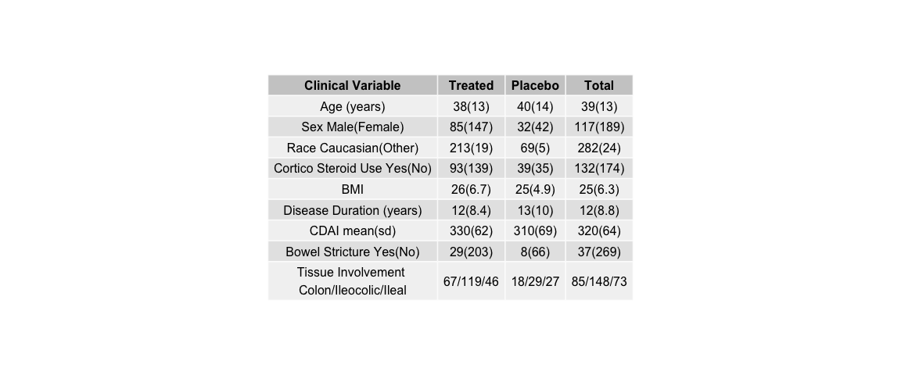

\newpage
**Table 1: Diversity differences based on clinical metadata of chort at
baseline**

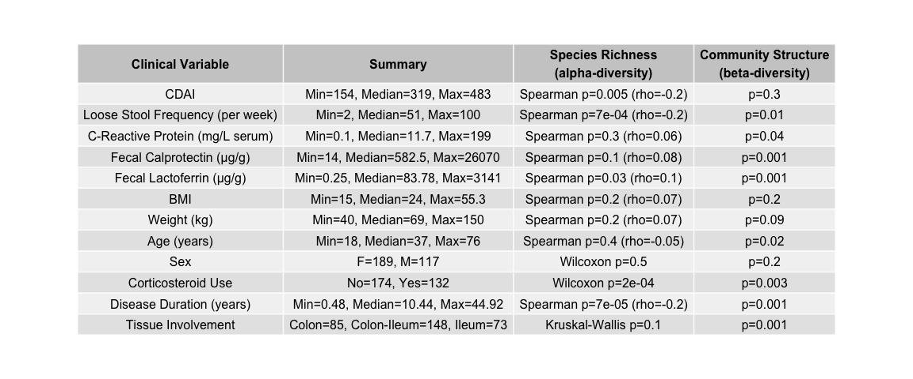

\newpage
**Table 2: Diversity differenced bases on Response/Remission in treated
subjects.**

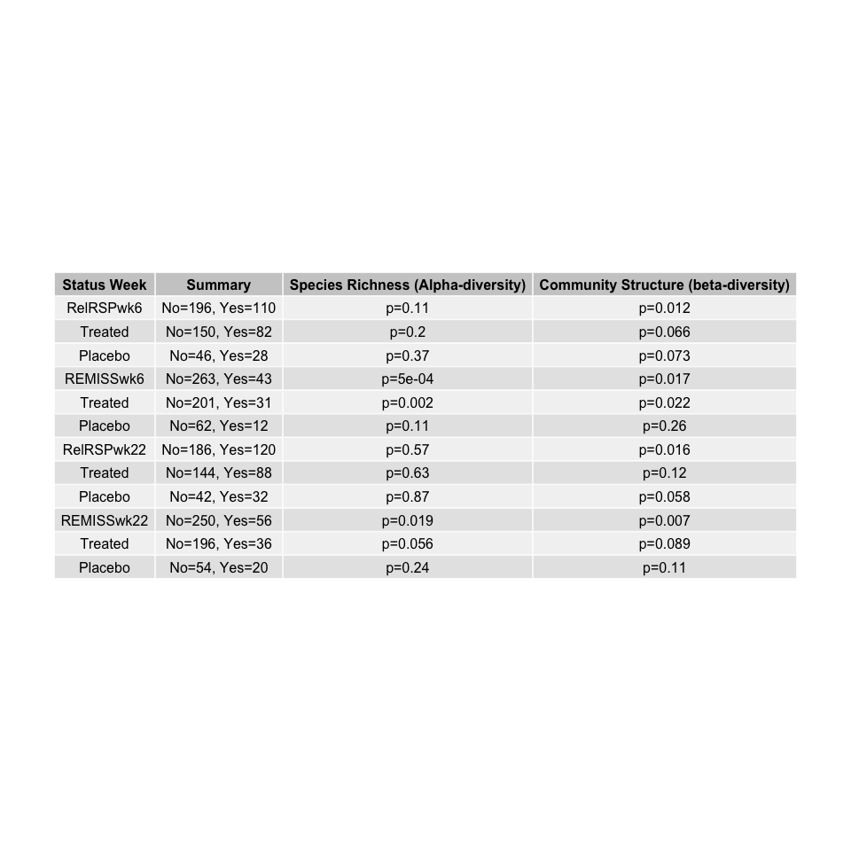

\newpage
**Supplemental Table 2: Table of taxa that appear frequently in
predictive models at different response weeks, use baseline and
post-treat time points, also pooled**

\newpage
Figures
-------

**Figure 1: Prediction of RESPONSE/REMISSION in treated subjects using
all clinical metadata, baseline microbiome alone, and combined**
*Question:* Can the microbiome, clinical metadata, or combined models
reliably predict response? *Goal:* Show clinical metadata isn’t great
for prediction and improvement of prediction using microbiome. Show taxa
marked as important for prediction are abundant enough to care about A.
Response ROCs B. Response Model Performance vs. reality C. Top
predictive taxa and abundance based on response  
D. REMISSION ROCs E. REMISSION Model Performance vs. reality F. Top
predictive taxa and abundance based on remission

    ## 
    ## Call:
    ## roc.formula(formula = otu_relrespWK6$RelRSPwk6 ~ otu_relrespWK6_probs)
    ## 
    ## Data: otu_relrespWK6_probs in 150 controls (otu_relrespWK6$RelRSPwk6 0) < 82 cases (otu_relrespWK6$RelRSPwk6 1).
    ## Area under the curve: 0.7136

    ## 
    ## Call:
    ## roc.formula(formula = md_relrespWK6$RelRSPwk6 ~ md_relrespWK6_probs)
    ## 
    ## Data: md_relrespWK6_probs in 150 controls (md_relrespWK6$RelRSPwk6 0) < 82 cases (md_relrespWK6$RelRSPwk6 1).
    ## Area under the curve: 0.6654

    ## 
    ## Call:
    ## roc.formula(formula = mdotu_relrespWK6$RelRSPwk6 ~ mdotu_relrespWK6_probs)
    ## 
    ## Data: mdotu_relrespWK6_probs in 150 controls (mdotu_relrespWK6$RelRSPwk6 0) < 82 cases (mdotu_relrespWK6$RelRSPwk6 1).
    ## Area under the curve: 0.6819

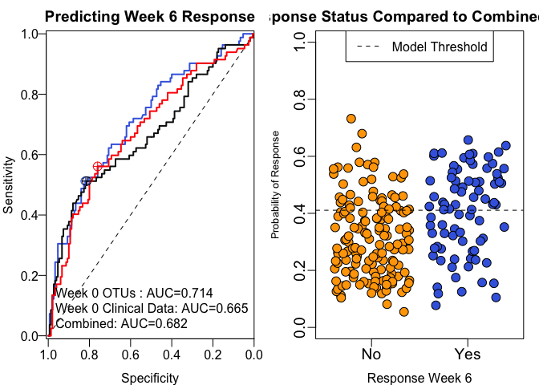

    ## 
    ## Call:
    ## roc.formula(formula = otu_remWK6$REMISSwk6 ~ otu_remWK6_probs)
    ## 
    ## Data: otu_remWK6_probs in 201 controls (otu_remWK6$REMISSwk6 0) < 31 cases (otu_remWK6$REMISSwk6 1).
    ## Area under the curve: 0.8317

    ## 
    ## Call:
    ## roc.formula(formula = md_remWK6$REMISSwk6 ~ md_remWK6_probs)
    ## 
    ## Data: md_remWK6_probs in 201 controls (md_remWK6$REMISSwk6 0) < 31 cases (md_remWK6$REMISSwk6 1).
    ## Area under the curve: 0.6368

    ## 
    ## Call:
    ## roc.formula(formula = mdotu_remWK6$REMISSwk6 ~ mdotu_remWK6_probs)
    ## 
    ## Data: mdotu_remWK6_probs in 201 controls (mdotu_remWK6$REMISSwk6 0) < 31 cases (mdotu_remWK6$REMISSwk6 1).
    ## Area under the curve: 0.7878

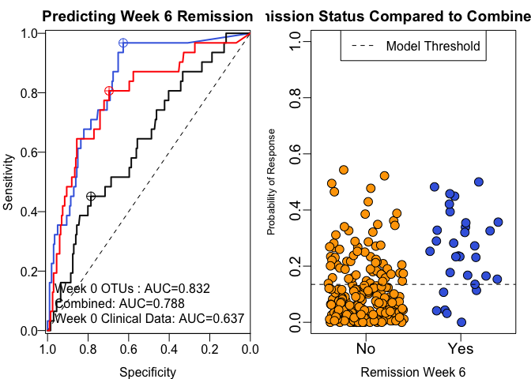

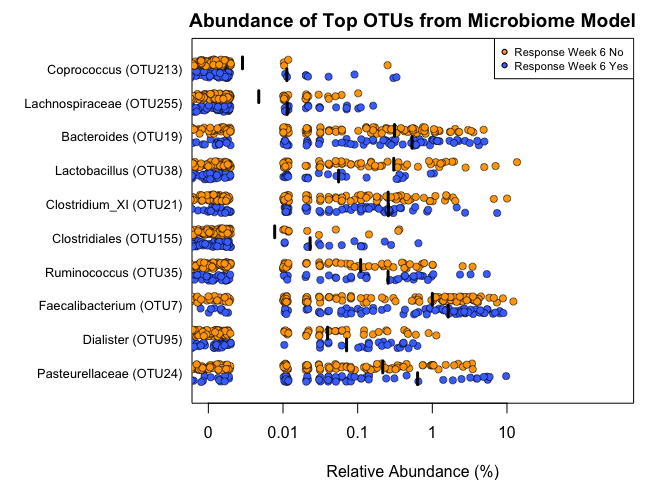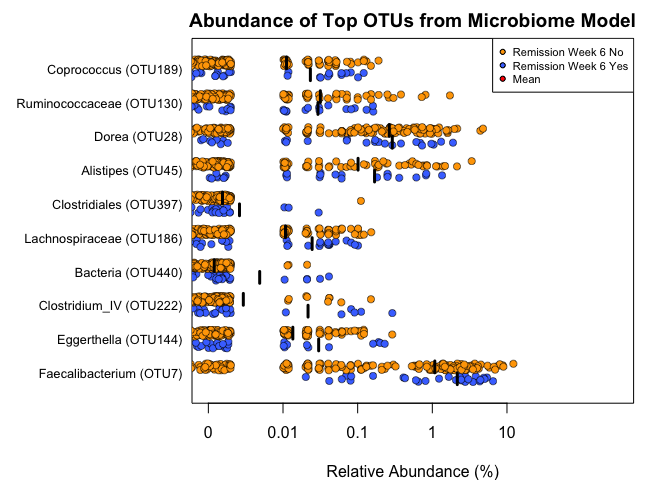

\newpage
**Figure 2: Lefse data supporting the abundance/importance data in the
predictive models** Abundance strip charts of differential taxa based on
A) response and B) remission.

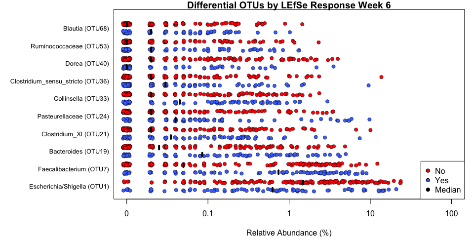

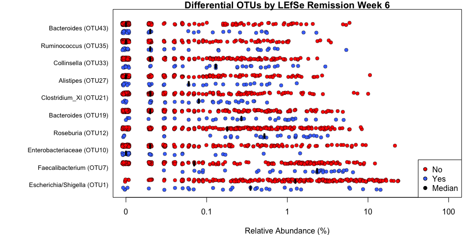

\newpage
**Figure 3: Abundance of frequently predictive OTUs in responders and
remitters**

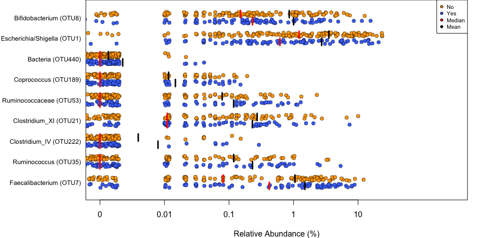

\newpage
**Supplemental Figure 1: Determining Week 6 disease status using Week 6
samples**

    ## 
    ## Call:
    ## roc.formula(formula = otu_relrespWK6xWK6$RelRSPwk6 ~ otu_relrespWK6xWK6_probs)
    ## 
    ## Data: otu_relrespWK6xWK6_probs in 142 controls (otu_relrespWK6xWK6$RelRSPwk6 0) < 78 cases (otu_relrespWK6xWK6$RelRSPwk6 1).
    ## Area under the curve: 0.6956

    ## 
    ## Call:
    ## roc.formula(formula = md_relrespWK6xWK6$RelRSPwk6 ~ md_relrespWK6xWK6_probs)
    ## 
    ## Data: md_relrespWK6xWK6_probs in 142 controls (md_relrespWK6xWK6$RelRSPwk6 0) < 78 cases (md_relrespWK6xWK6$RelRSPwk6 1).
    ## Area under the curve: 0.9375

    ## 
    ## Call:
    ## roc.formula(formula = mdotu_relrespWK6xWK6$RelRSPwk6 ~ mdotu_relrespWK6xWK6_probs)
    ## 
    ## Data: mdotu_relrespWK6xWK6_probs in 142 controls (mdotu_relrespWK6xWK6$RelRSPwk6 0) < 78 cases (mdotu_relrespWK6xWK6$RelRSPwk6 1).
    ## Area under the curve: 0.9369

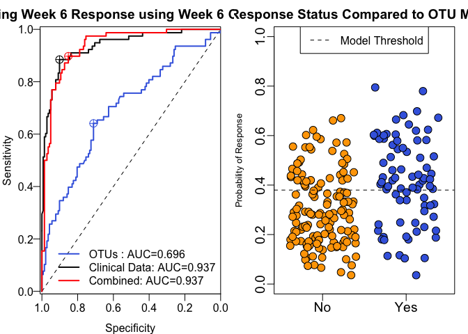

    ## 
    ## Call:
    ## roc.formula(formula = otu_remWK6xWK6$REMISSwk6 ~ otu_remWK6xWK6_probs)
    ## 
    ## Data: otu_remWK6xWK6_probs in 190 controls (otu_remWK6xWK6$REMISSwk6 0) < 30 cases (otu_remWK6xWK6$REMISSwk6 1).
    ## Area under the curve: 0.8382

    ## 
    ## Call:
    ## roc.formula(formula = md_remWK6xWK6$REMISSwk6 ~ md_remWK6xWK6_probs)
    ## 
    ## Data: md_remWK6xWK6_probs in 190 controls (md_remWK6xWK6$REMISSwk6 0) < 30 cases (md_remWK6xWK6$REMISSwk6 1).
    ## Area under the curve: 0.9853

    ## 
    ## Call:
    ## roc.formula(formula = mdotu_remWK6xWK6$REMISSwk6 ~ mdotu_remWK6xWK6_probs)
    ## 
    ## Data: mdotu_remWK6xWK6_probs in 190 controls (mdotu_remWK6xWK6$REMISSwk6 0) < 30 cases (mdotu_remWK6xWK6$REMISSwk6 1).
    ## Area under the curve: 0.9895

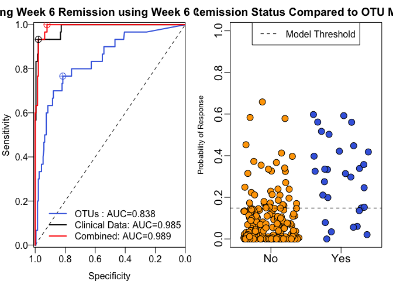
